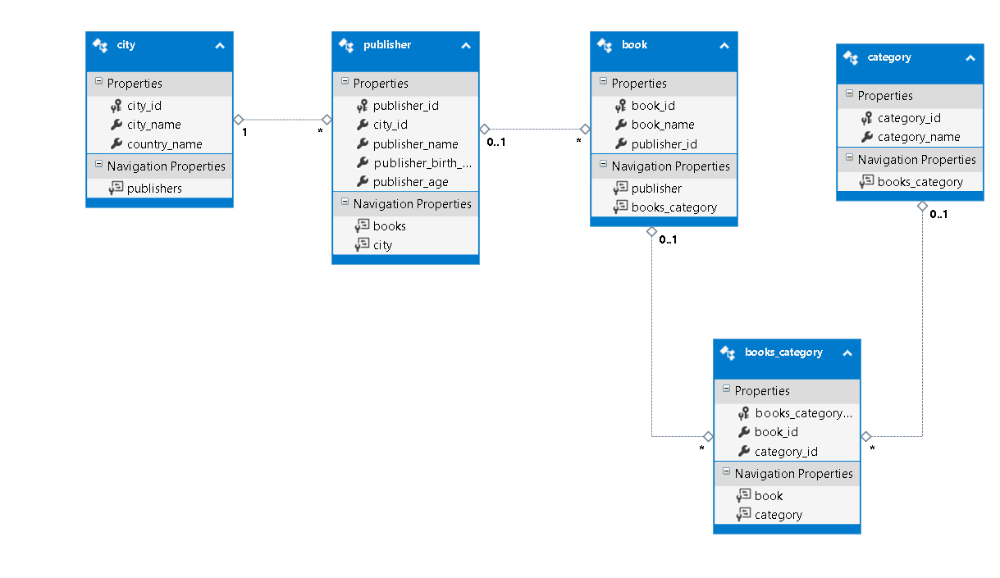

# `BookStore` Data Base

### Database platform
* mySql (server - xampp + client - workbench)


### Commands to create table
* Create the DB
```sql
CREATE DATABASE bookStore;
```


* CREATE TABLE cities
```sql
USE bookStore;
CREATE TABLE cities(

city_id 	    	int(3) AUTO_INCREMENT PRIMARY KEY,

city_name 	    	varchar(25),

country_name  		varchar(25)  NOT NULL CHECK (country_name IN ('USA','UK','Israel'))

);

```


* CREATE TABLE publisher (contains FK to cities table)
```sql
USE bookStore;
CREATE TABLE  publishers(

publisher_id 				int(3) NOT NULL AUTO_INCREMENT,

city_id 				int(3) NOT NULL,

publisher_name 	    			varchar(50) NOT NULL UNIQUE ,

publisher_birth_date			date NULL CHECK (publisher_birth_date LIKE '--/--/----'),

publisher_age 				int(3) NOT NULL CHECK(publisher_age>0 AND publisher_age<120),

PRIMARY KEY (publisher_id),

FOREIGN KEY (city_id) REFERENCES cities(city_id)

);


```


* CREATE TABLE categories
```sql
USE bookStore;

CREATE TABLE categories(

category_id 	int(3) AUTO_INCREMENT PRIMARY KEY,

category_name 	varchar(25)

);

```

* CREATE TABLE books
```sql
USE bookStore;

CREATE TABLE books(

book_id 	int(3) AUTO_INCREMENT PRIMARY KEY,

book_name 	varchar(25),

publisher_id	int(3) ,

FOREIGN KEY (publisher_id) REFERENCES publishers(publisher_id)

);

```


* CREATE TABLE books
```sql
USE bookStore;
CREATE TABLE books_category(

books_category_id 	    int(3) AUTO_INCREMENT PRIMARY KEY,

book_id	    	int(3) ,

category_id	int(3) ,

FOREIGN KEY (book_id) REFERENCES books(book_id),

FOREIGN KEY (category_id) REFERENCES categories(category_id)
);

```

### DataBase diagram:
   
***
***
  


### Commands to insert new rows in the tables 
* Insert 3 new records to cities table
```sql
USE bookStore;


INSERT INTO `bookstore`.`cities`

(`city_name`,`country_name`)

VALUES
('NY','USA');

INSERT INTO `bookstore`.`cities`

(`city_name`,`country_name`)

VALUES
('London','UK');


INSERT INTO `bookstore`.`cities`

(`city_name`,`country_name`)

VALUES
('Ariel','Israel');

```
 


